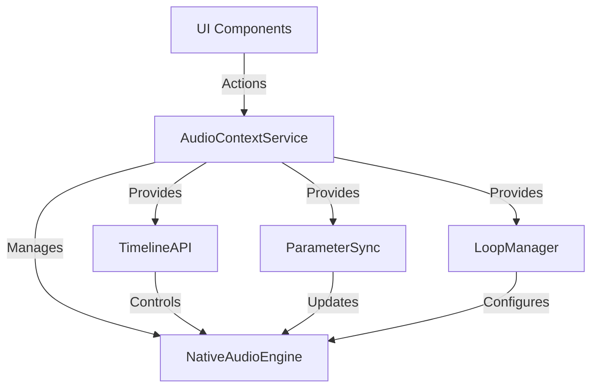
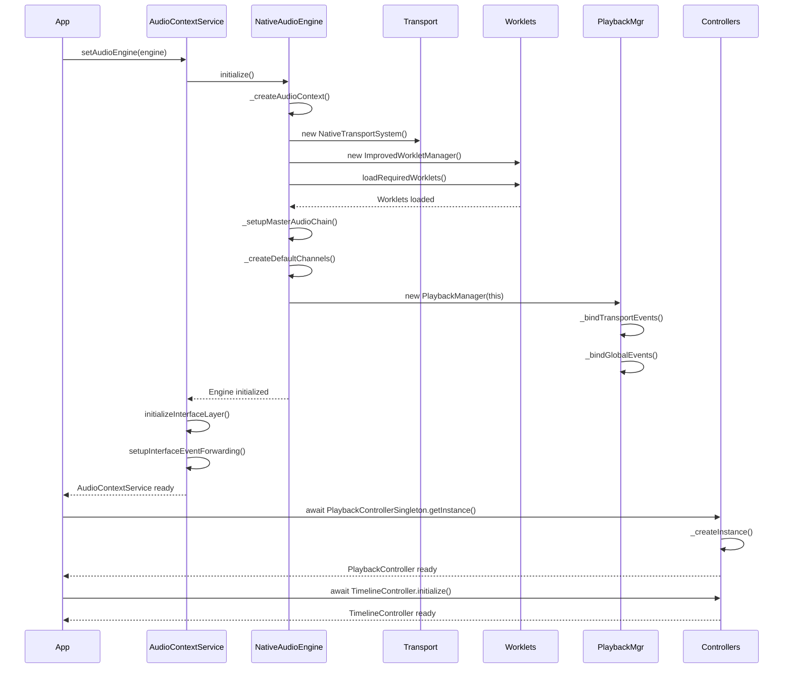
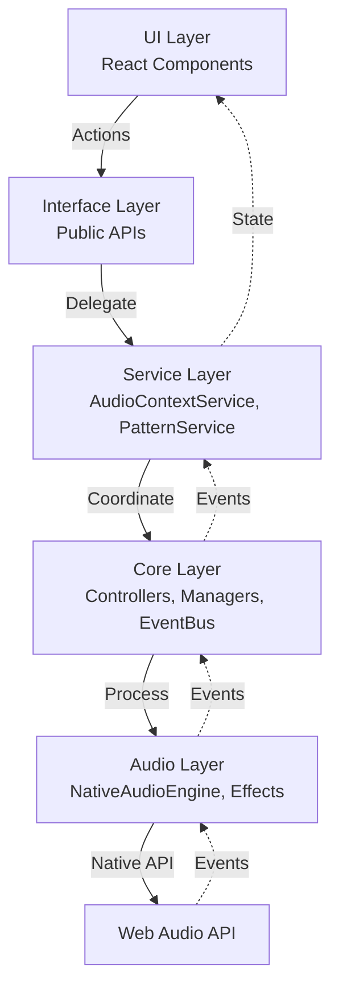
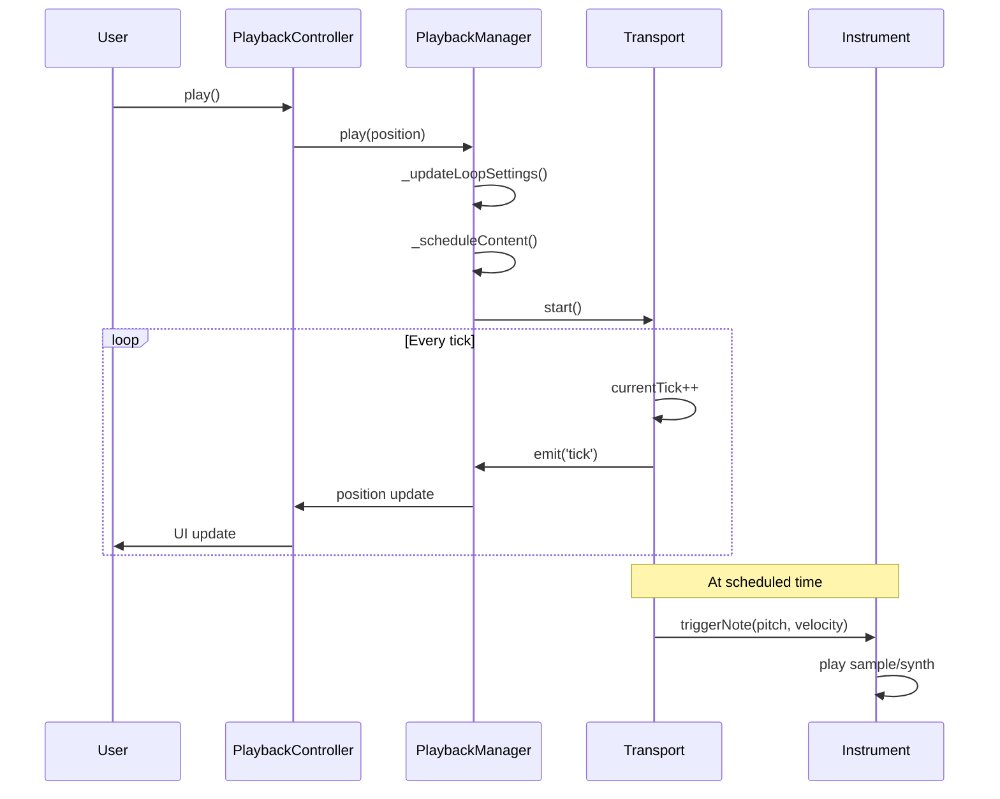
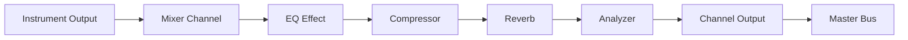

# DAWG Audio Engine - Architecture Documentation

> **Comprehensive architecture analysis of the `/lib` folder**
>
> **Date**: 2025-10-08
> **Status**: Phase 1 Complete - BaseSingleton Pattern, 11 Barrel Exports, Cleanup
>
> This document maps the complete data flow, system layers, initialization sequence, and architectural patterns used in DAWG's core audio engine.

---

## Table of Contents

1. [System Overview](#system-overview)
2. [Layer Architecture](#layer-architecture)
3. [Initialization Flow](#initialization-flow)
4. [Data Flow Diagrams](#data-flow-diagrams)
5. [Communication Patterns](#communication-patterns)
6. [User Action Workflows](#user-action-workflows)
7. [Design Patterns](#design-patterns)
8. [Store Integration](#store-integration)
9. [Current State vs Planned](#current-state-vs-planned)

---

## System Overview

DAWG's `/lib` folder implements a **layered audio engine architecture** with clear separation of concerns:

```
┌─────────────────────────────────────────────────────────────────┐
│                         UI LAYER (React)                         │
│   Components consume stores & lib exports via barrel files      │
└─────────────────────────────────────────────────────────────────┘
                               ▲ │
                               │ │ Events & State Updates
                               │ ▼
┌─────────────────────────────────────────────────────────────────┐
│                    INTERFACE LAYER (lib/interfaces)              │
│  TimelineSelectionAPI │ RealtimeParameterSync │ DynamicLoopMgr  │
└─────────────────────────────────────────────────────────────────┘
                               ▲ │
                               │ │ Public API Calls
                               │ ▼
┌─────────────────────────────────────────────────────────────────┐
│                    SERVICE LAYER (lib/services)                  │
│      AudioContextService      │      PatternService              │
│   (Central coordination hub)  │  (Pattern CRUD operations)       │
└─────────────────────────────────────────────────────────────────┘
                               ▲ │
                               │ │ Service Delegation
                               │ ▼
┌─────────────────────────────────────────────────────────────────┐
│                     CORE LAYER (lib/core)                        │
│  Singletons │ Controllers │ Managers │ EventBus │ Transport     │
└─────────────────────────────────────────────────────────────────┘
                               ▲ │
                               │ │ Audio Processing
                               │ ▼
┌─────────────────────────────────────────────────────────────────┐
│                    AUDIO LAYER (lib/audio)                       │
│   NativeAudioEngine │ Effects │ Worklets │ Rendering            │
└─────────────────────────────────────────────────────────────────┘
                               ▲ │
                               │ │ Web Audio API
                               │ ▼
┌─────────────────────────────────────────────────────────────────┐
│                      WEB AUDIO API / BROWSER                     │
│              AudioContext │ AudioWorklet │ Scheduler             │
└─────────────────────────────────────────────────────────────────┘
```

**Key Metrics**:
- **Total Files**: 85 JavaScript modules
- **Barrel Exports**: 11 index.js files for organized imports
- **Singleton Wrappers**: 3 (PlaybackController, TimelineController, TransportManager)
- **Design Patterns**: Singleton, Command, Observer/EventBus, Factory, Strategy

---

## Layer Architecture

### 1. **Interface Layer** (`/lib/interfaces`)

**Purpose**: Public APIs for external integrations and advanced features

**Modules**:
- `TimelineSelectionAPI.js` - Timeline selection, scrubbing, navigation
- `RealtimeParameterSync.js` - Real-time parameter automation
- `DynamicLoopManager.js` - Intelligent loop calculation

**Responsibilities**:
- Provide clean, documented APIs
- Handle complex workflows
- Bridge UI intentions to core systems

---

### 2. **Service Layer** (`/lib/services`)

**Purpose**: High-level business logic and coordination

#### `AudioContextService.js` - **Central Hub**



**Key Features**:
- **Singleton Pattern**: Single instance across app
- **Interface Management**: Initializes Timeline/Parameter/Loop APIs
- **Event Forwarding**: Bridges transport events to UI
- **Mixer Control**: Central mixer parameter updates
- **Effect Management**: Signal chain rebuilding
- **Instrument Management**: CRUD operations for instruments

**Public Methods**:
```javascript
// Playback
play() / stop() / pause()
setBPM(bpm)

// Mixer
updateMixerParam(trackId, param, value)
rebuildSignalChain(trackId, trackState)

// Effects
updateEffectParam(trackId, effectId, param, value)
getEffectNode(trackId, effectId)

// Instruments
createInstrument(instrument)
setInstrumentMute(instrumentId, isMuted)
reconcileInstrument(instrumentId, instrumentData)

// Interface APIs
timeline.jumpToStep(step)
parameters.set(targetId, parameter, value)
loop.setMode(mode)
```

#### `PatternService.js` - **Pattern Operations**

**Static service** for pattern manipulation:
- `clearPattern(patternId)` - Clear all notes
- `quantizePattern(patternId, gridValue, strength)` - Quantize notes
- `analyzePattern(patternId)` - Get pattern statistics
- `optimizePattern(patternId)` - Remove empty data
- `mergePatterns(patternIds, name, mode)` - Merge multiple patterns
- `exportPattern(patternId, format)` - Export (JSON/MIDI/Audio)
- `importPattern(patternData, name)` - Import patterns
- `validateAndFixPattern(patternId)` - Integrity checks

---

### 3. **Core Layer** (`/lib/core`)

**Purpose**: Core audio engine orchestration and state management

#### **Singleton Wrappers**

**BaseSingleton Pattern** (New in Phase 1):
```javascript
// Unified pattern for all singletons
class BaseSingleton {
  static instance = null;
  static initPromise = null;
  static subscribers = new Set();

  static async getInstance() { /* Lazy initialization */ }
  static getInstanceSync() { /* Sync access */ }
  static isReady() { /* Check initialization */ }
  static reset() { /* Cleanup */ }
  static onLifecycle(callback) { /* Lifecycle events */ }
}
```

**Singletons**:
1. **PlaybackControllerSingleton** - Unified playback state management
2. **TimelineControllerSingleton** - Timeline control (legacy pattern)
3. **TransportManagerSingleton** - Transport coordination

#### **PlaybackController** - **State Management**

```javascript
// Single source of truth for playback state
state = {
  playbackState: PLAYBACK_STATES.STOPPED,
  isPlaying: false,
  currentPosition: 0,  // Always in steps, synced with engine
  bpm: 140,
  loopStart: 0,
  loopEnd: 64,
  loopEnabled: true,
  isUserScrubbing: false,
  ghostPosition: null
}
```

**Commands**:
- `play(startPosition)` - Start playback
- `pause()` - Pause playback
- `stop()` - Stop and reset position
- `togglePlayPause()` - Smart toggle
- `jumpToPosition(position, options)` - Position control
- `setBPM(bpm)` - Tempo control
- `setLoopRange(start, end)` - Loop configuration

**Event System**:
```javascript
// EventEmitter-based
controller.on('state-change', (data) => { /* ... */ })
controller.on('position-update', (data) => { /* ... */ })
controller.on('ghost-position-change', (position) => { /* ... */ })

// Direct subscription (for stores)
controller.subscribe(callback)
```

#### **PlaybackManager** - **Content Scheduling**

**Advanced scheduling system** with pattern/song mode support:

```javascript
// Playback modes
currentMode: 'pattern' | 'song'

// Loop management
loopEnabled: true
loopStart: 0
loopEnd: 64
isAutoLoop: true  // Auto-calculate loop points

// Pattern mode
activePatternId: null
patternLength: 64

// Song mode
songLength: 256
playbackCursor: 0
```

**Key Features**:
- **Debounced Scheduling**: Prevents excessive rescheduling (SchedulingOptimizer)
- **Loop Restart Handling**: Clean loop transitions
- **EventBus Integration**: Central pattern/note change handling
- **Position Tracking**: Accurate position management via PositionTracker
- **Audio Clip Support**: Schedule frozen audio clips in song mode

**Event Handlers**:
```javascript
// Via EventBus
'PATTERN_CHANGED' → _handlePatternChange()
'NOTE_ADDED' → _handleNoteAdded()
'NOTE_REMOVED' → _handleNoteRemoved()
'NOTE_MODIFIED' → _handleNoteModified()

// From Transport
'loop' → _handleLoopRestart()
'start' → emit 'transportStart'
'stop' → emit 'transportStop'
'pause' → emit 'transportPause'
```

#### **EventBus** - **Global Event System**

**Simple but powerful** event emitter for decoupled communication:

```javascript
// Core events
EventBus.emit('PATTERN_CHANGED', { patternId, changeType })
EventBus.emit('NOTE_ADDED', { patternId, instrumentId, note })
EventBus.emit('NOTE_REMOVED', { patternId, instrumentId, noteId })
EventBus.emit('NOTE_MODIFIED', { patternId, instrumentId, note })

// Throttled events (performance)
'positionUpdate' → 60fps
'levelMeter' → 30fps
'NOTE_*' → 20fps
```

#### **UIUpdateManager** - **RAF Loop Coordination**

**Centralized requestAnimationFrame loop** for all UI updates:

**Features**:
- **Single RAF Loop**: All updates in one loop
- **Priority-Based**: CRITICAL → HIGH → NORMAL → LOW → BACKGROUND
- **Throttling**: Per-subscriber frequency control
- **Adaptive Performance**: Automatic quality adjustment based on FPS
- **Batch DOM Updates**: Minimize reflows/repaints

```javascript
// Update priorities
UPDATE_PRIORITIES.CRITICAL = 100  // Transport, audio-critical
UPDATE_PRIORITIES.HIGH = 80       // Playheads, timelines
UPDATE_PRIORITIES.NORMAL = 60     // General UI
UPDATE_PRIORITIES.LOW = 40        // Visualizations
UPDATE_PRIORITIES.BACKGROUND = 20 // Debug, metrics

// Update frequencies
UPDATE_FREQUENCIES.REALTIME = 0    // 60fps
UPDATE_FREQUENCIES.HIGH = 16.67    // ~60fps
UPDATE_FREQUENCIES.MEDIUM = 33.33  // ~30fps
UPDATE_FREQUENCIES.LOW = 100       // ~10fps
UPDATE_FREQUENCIES.VERY_LOW = 1000 // ~1fps

// Usage
const unsubscribe = uiUpdateManager.subscribe(
  'my-component',
  (currentTime, frameTime) => { /* update logic */ },
  UPDATE_PRIORITIES.HIGH,
  UPDATE_FREQUENCIES.HIGH
);
```

#### **NativeTransportSystem** - **Timing Engine**

**High-precision transport** using Web Audio API scheduler:

**Features**:
- Sample-accurate scheduling
- BPM/time signature management
- Loop point control
- Event scheduling
- Tick/step conversion

---

### 4. **Audio Layer** (`/lib/audio`)

**Purpose**: Audio processing, effects, and rendering

#### **NativeAudioEngine** - **Core Audio Processing**

**Main audio engine** managing all audio processing:

```javascript
// Core systems
audioContext: AudioContext
transport: NativeTransportSystem
playbackManager: PlaybackManager
workletManager: ImprovedWorkletManager

// Audio routing
masterMixer: AudioWorkletNode
masterCompressor: DynamicsCompressor
masterLimiter: GainNode
masterAnalyzer: AnalyserNode

// Collections
instruments: Map<id, Instrument>
mixerChannels: Map<id, MixerChannel>
effects: Map<id, Effect>
sampleBuffers: Map<id, AudioBuffer>
```

**Signal Chain**:
```
Instrument → MixerChannel → Effects → Analyzer → MasterMixer →
Compressor → Limiter → Analyzer → Destination
```

**Instrument Types**:
1. **NativeSamplerNode** - Sample-based instruments
2. **NativeSynthInstrument** - WorkletNode-based synths

**Mixer Channels** (NativeMixerChannel):
- Volume, pan, mute, solo
- 3-band EQ (low/mid/high)
- Effect chain support
- Real-time metering

#### **Effect System**

**Modular effect architecture** with registry pattern:

**EffectRegistry**:
```javascript
// Centralized effect creation
effectRegistry.createEffectNode(type, audioContext, settings)

// Supported effects
'delay', 'reverb', 'waveshaper', 'compressor',
'eq', 'filter', 'distortion', 'chorus', 'flanger'
```

**Effect Classes**:
- `BaseEffect` - Base class for all effects
- `WorkletEffect` - AudioWorklet-based effects
- `DelayEffect` - Delay/echo
- `ReverbEffect` - Reverb/room simulation
- `WaveshaperEffect` - Distortion/saturation

**EffectFactory**:
```javascript
// Serialization/deserialization
EffectFactory.create(type, audioContext, settings)
EffectFactory.serialize(effect)
EffectFactory.deserialize(data, audioContext)
```

#### **Worklet Management**

**ImprovedWorkletManager** - AudioWorklet lifecycle:
- Dynamic worklet loading
- Error handling
- Worklet node creation
- State management

**Available Worklets**:
- `instrument-processor` - Synth engine
- `mixer-processor` - Mixer strip
- `analysis-processor` - Metering/analysis

---

### 5. **Utilities Layer** (`/lib/utils`)

**Purpose**: Reusable utilities and helpers

**Time & Music**:
- `NativeTimeUtils.js` - Time/BPM calculations
- `patternUtils.js` - Pattern analysis/loop calculation
- `audioMath.js` - Audio math utilities

**Performance**:
- `objectPool.js` - Object pooling for performance
- `performanceMonitor.js` - Performance tracking
- `scrollSync.js` - Synchronized scrolling

**UI**:
- `pianoRollUtils.js` - Piano roll calculations
- `windowManager.js` - Window management

---

### 6. **Commands Layer** (`/lib/commands`)

**Purpose**: Undo/redo system using Command pattern

```javascript
// Command pattern
class Command {
  execute() { /* perform action */ }
  undo() { /* reverse action */ }
}

// Examples
AddNoteCommand
DeleteNoteCommand

// Manager
CommandManager.execute(command)
CommandManager.undo()
CommandManager.redo()
```

---

### 7. **Visualization Layer** (`/lib/visualization`)

**Purpose**: WebGL-based audio visualization

**VisualizationEngine** - Manages visualizers

**Visualizers**:
- `BaseVisualizer` - Base class
- `WebGLVisualizer` - WebGL rendering
- `WaveformVisualizer` - Waveform display
- `WebGLWaveform` - GPU-accelerated waveform
- `WebGLSpectrumAnalyzer` - Frequency spectrum
- `WebGLOscilloscope` - Oscilloscope view

---

### 8. **Piano Roll Tools** (`/lib/piano-roll-tools`)

**Purpose**: Advanced MIDI editing tools

**Tools**:
- `ArpeggiatorTool` - Arpeggiator
- `ChopperTool` - Note chopper
- `FlamTool` - Flam effect
- `FlipTool` - Note flipping
- `PaintBrushTool` - Drawing notes
- `RandomizerTool` - Randomization
- `StrumizerTool` - Strum effect

**Management**:
- `PianoRollToolManager` - Tool lifecycle
- `ToolFactory` - Tool instantiation

---

## Initialization Flow

### Application Startup Sequence



### Singleton Initialization (BaseSingleton Pattern)

```javascript
// Phase 1 - Lazy initialization
const controller = await PlaybackControllerSingleton.getInstance();

// Internal flow:
// 1. Check if instance exists → return if yes
// 2. Check if initPromise exists → await if yes (race condition protection)
// 3. Create initPromise = _createInstance()
// 4. Await instance creation
// 5. Store instance
// 6. Notify lifecycle subscribers
// 7. Return instance

// Lifecycle monitoring
PlaybackControllerSingleton.onLifecycle((event, data) => {
  // Events: 'initializing', 'initialized', 'error', 'reset'
});
```

---

## Data Flow Diagrams

### 1. Playback Flow - User Clicks Play

```
┌─────────────┐
│ UI Component│
│ (Play btn)  │
└──────┬──────┘
       │ onClick
       ▼
┌──────────────────────┐
│ PlaybackController   │
│  .play()            │
└──────┬───────────────┘
       │
       ▼
┌──────────────────────┐
│ AudioEngine          │
│  .playbackManager    │
│   .play()           │
└──────┬───────────────┘
       │
       ├──► Update loop settings
       │
       ├──► Schedule content (_schedulePatternContent)
       │     │
       │     ├──► Get active pattern from store
       │     │
       │     └──► For each instrument:
       │           └──► _scheduleInstrumentNotes()
       │                 └──► transport.scheduleEvent()
       │
       └──► Transport.start()
             │
             ├──► Set internal state (playing)
             │
             ├──► Start tick loop
             │
             └──► Emit 'start' event
                   │
                   ├──► PlaybackManager updates state
                   │
                   ├──► PlaybackController updates state
                   │
                   └──► UI updates via store subscription
```

**Detailed Flow**:

1. **User Action**: Click play button
2. **PlaybackController**: Validates state, calls `play()`
3. **Position Setup**: Sets currentPosition (0 or resume point)
4. **PlaybackManager**:
   - Updates loop settings (auto-calculate pattern length)
   - Schedules all notes via `_schedulePatternContent()`
5. **Transport**: Starts tick loop, begins scheduling events
6. **Note Scheduling**: Each note scheduled at precise audio time
7. **Instruments**: Trigger notes at scheduled times
8. **State Propagation**: Events flow back to UI via EventBus/stores

### 2. Note Addition Flow

```
┌─────────────┐
│ UI Component│
│ (Piano Roll)│
└──────┬──────┘
       │ addNote()
       ▼
┌──────────────────────┐
│ useArrangementStore  │
│  .updatePatternNotes │
└──────┬───────────────┘
       │
       ▼
┌──────────────────────┐
│ EventBus             │
│  .emit('NOTE_ADDED') │
└──────┬───────────────┘
       │
       ▼
┌──────────────────────┐
│ PlaybackManager      │
│  ._handleNoteAdded() │
└──────┬───────────────┘
       │
       ├──► If playing: _scheduleNewNotesImmediate()
       │                 │
       │                 └──► Calculate loop-aware timing
       │                      └──► transport.scheduleEvent()
       │
       └──► If stopped: No action (will schedule on next play)
```

**Key Points**:
- **Immediate Scheduling**: New notes scheduled mid-playback
- **Loop-Aware**: Calculates if note plays this loop or next
- **No Full Reschedule**: Avoids expensive full rescheduling
- **EventBus Coordination**: Central event handling prevents conflicts

### 3. Effect Addition Flow

```
┌─────────────┐
│ UI Component│
│ (Mixer)     │
└──────┬──────┘
       │ addEffect()
       ▼
┌──────────────────────┐
│ useMixerStore        │
│  .addInsertEffect    │
└──────┬───────────────┘
       │ Store updated
       ▼
┌──────────────────────┐
│ useEffect in Mixer   │
│  watches trackState  │
└──────┬───────────────┘
       │ Effect added to state
       ▼
┌──────────────────────┐
│ AudioContextService  │
│  .rebuildSignalChain │
└──────┬───────────────┘
       │
       ├──► Fade out channel (prevent clicks)
       │
       ├──► Dispose old effects
       │
       ├──► For each effect:
       │     └──► channel.addEffect(type, settings, id)
       │           │
       │           └──► EffectRegistry.createEffectNode()
       │                 │
       │                 └──► Return AudioWorkletNode
       │
       ├──► Rebuild signal chain:
       │     mixerNode → effects → analyzer → output
       │
       └──► Fade in channel
```

**Signal Chain**:
```
[Instrument Output]
       ↓
[Mixer Channel Input]
       ↓
[Effect 1] (e.g., EQ)
       ↓
[Effect 2] (e.g., Compressor)
       ↓
[Effect 3] (e.g., Reverb)
       ↓
[Analyzer] (metering)
       ↓
[Channel Output]
       ↓
[Master Mixer]
```

### 4. Position Update Flow (During Playback)

```
┌──────────────────────┐
│ Transport            │
│  (tick loop)         │
└──────┬───────────────┘
       │ Every tick (~10ms)
       ▼
┌──────────────────────┐
│ Transport.emit('tick')│
└──────┬───────────────┘
       │
       ├──► PlaybackManager receives
       │     │
       │     └──► PositionTracker.getDisplayPosition()
       │           │
       │           └──► Calculate clean position
       │                 └──► emit 'positionUpdate'
       │
       └──► PlaybackController receives
             │
             └──► _updatePositionFromMotor()
                   │
                   ├──► Update state.currentPosition
                   │
                   └──► emit 'position-update'
                         │
                         └──► UI subscribers update
```

**UIUpdateManager Integration**:
```
┌──────────────────────┐
│ UIUpdateManager      │
│  (60fps RAF loop)    │
└──────┬───────────────┘
       │ Every frame
       ▼
┌──────────────────────┐
│ Subscribers (sorted  │
│ by priority)         │
└──────┬───────────────┘
       │
       ├──► CRITICAL: Transport state
       ├──► HIGH: Playhead renderers
       ├──► NORMAL: General UI updates
       ├──► LOW: Visualizations
       └──► BACKGROUND: Debug info
```

---

## Communication Patterns

### 1. **EventBus Pattern** - Decoupled Communication

**Usage**: System-wide events for loosely coupled modules

```javascript
// Emit
EventBus.emit('PATTERN_CHANGED', { patternId, changeType });

// Subscribe
EventBus.on('PATTERN_CHANGED', (data) => {
  // Handle pattern change
});

// Throttled automatically for high-frequency events
```

**Benefits**:
- **Decoupling**: Modules don't need direct references
- **Scalability**: Easy to add new subscribers
- **Performance**: Built-in throttling

### 2. **Direct Service Calls** - Synchronous Operations

**Usage**: When immediate response needed or strong coupling acceptable

```javascript
// AudioContextService acts as facade
AudioContextService.updateMixerParam(trackId, 'volume', -6);
AudioContextService.rebuildSignalChain(trackId, trackState);
AudioContextService.parameters.set(targetId, 'cutoff', 1000);
```

**Benefits**:
- **Simplicity**: Straightforward call chain
- **Type Safety**: Direct method calls
- **Debugging**: Easy to trace

### 3. **Store Subscriptions** - Reactive State**

**Usage**: UI components react to state changes

```javascript
// Store updates trigger UI re-render
const { patterns, activePatternId } = useArrangementStore();

// Store subscriptions in lib layer
useArrangementStore.subscribe((state, prevState) => {
  if (state.activePatternId !== prevState.activePatternId) {
    // React to pattern change
  }
});
```

**Benefits**:
- **Reactivity**: Automatic UI updates
- **State Management**: Zustand handles diffing
- **Predictability**: Clear data flow

### 4. **Observer Pattern** - Lifecycle Events

**Usage**: Singleton lifecycle, playback state changes

```javascript
// Lifecycle monitoring
PlaybackControllerSingleton.onLifecycle((event, data) => {
  if (event === 'initialized') {
    console.log('Controller ready');
  }
});

// State subscription
controller.subscribe((stateChange) => {
  const { state, reason } = stateChange;
  // Update UI based on state
});
```

**Benefits**:
- **Initialization Handling**: Know when singletons ready
- **State Tracking**: Monitor state changes
- **Cleanup**: Unsubscribe functions for memory management

### 5. **RAF Coordination** - UI Updates

**Usage**: Centralized animation frame loop

```javascript
// Subscribe to UIUpdateManager
const unsubscribe = uiUpdateManager.subscribe(
  'playhead-renderer',
  (currentTime, frameTime) => {
    // Update playhead position
    updatePlayheadDOM();
  },
  UPDATE_PRIORITIES.HIGH,
  UPDATE_FREQUENCIES.REALTIME
);

// Cleanup
unsubscribe();
```

**Benefits**:
- **Performance**: Single RAF loop
- **Priority Control**: Important updates first
- **Throttling**: Prevent over-rendering
- **Adaptive**: Automatic quality adjustment

---

## User Action Workflows

### Workflow 1: User Clicks Play

**Actors**: User → UI → PlaybackController → PlaybackManager → Transport → Instruments

**Steps**:

1. **User Action**:
   ```javascript
   // User clicks play button
   <button onClick={() => playbackController.play()}>
   ```

2. **PlaybackController Validation**:
   ```javascript
   // Check if already playing
   if (this.state.isPlaying) return false;

   // Set position
   if (startPosition !== null) {
     await this._jumpToPositionInternal(startPosition);
   }
   ```

3. **PlaybackManager Preparation**:
   ```javascript
   // Update loop settings
   this._updateLoopSettingsImmediate();

   // Calculate pattern loop length
   this._calculatePatternLoop();
   // → loopEnd = 64 (4 bars for typical pattern)
   ```

4. **Content Scheduling**:
   ```javascript
   // Schedule all pattern notes
   this._schedulePatternContent(startTime);

   // For each instrument in pattern:
   Object.entries(pattern.data).forEach(([instrumentId, notes]) => {
     this._scheduleInstrumentNotes(instrument, notes, baseTime);
   });
   ```

5. **Transport Start**:
   ```javascript
   // Start precise timing
   this.transport.start(startTime);

   // Tick loop begins
   setInterval(() => {
     this.currentTick += tickIncrement;
     this.emit('tick', { tick: this.currentTick });
   }, tickInterval);
   ```

6. **Note Triggering**:
   ```javascript
   // At scheduled time, for each note:
   transport.scheduleEvent(absoluteTime, (scheduledTime) => {
     instrument.triggerNote(pitch, velocity, scheduledTime, duration);
   });

   // NativeSamplerNode plays sample
   source.start(scheduledTime, 0, duration);
   ```

7. **State Propagation**:
   ```javascript
   // PlaybackController updates
   this.state.isPlaying = true;
   this._emitStateChange('play-command');

   // UI updates via subscription
   controller.subscribe(({ state }) => {
     setPlaybackState(state.playbackState);
   });
   ```

**Result**: Audio plays, playhead animates, transport controls update

---

### Workflow 2: User Adds Effect to Track

**Actors**: User → UI → MixerStore → AudioContextService → NativeAudioEngine → EffectRegistry

**Steps**:

1. **User Action**:
   ```javascript
   // User selects "Add Reverb" in mixer
   <EffectSelector onChange={(type) => addEffect(type)} />
   ```

2. **Store Update**:
   ```javascript
   // useMixerStore
   addInsertEffect: (trackId, effectType) => {
     const effectId = `fx-${Date.now()}`;
     const effect = {
       id: effectId,
       type: effectType,
       bypass: false,
       settings: getDefaultSettings(effectType)
     };

     set(state => ({
       tracks: {
         ...state.tracks,
         [trackId]: {
           ...state.tracks[trackId],
           insertEffects: [...state.tracks[trackId].insertEffects, effect]
         }
       }
     }));
   }
   ```

3. **React Effect Trigger**:
   ```javascript
   // Mixer component watches trackState
   useEffect(() => {
     // Rebuild signal chain when effects change
     AudioContextService.rebuildSignalChain(trackId, trackState);
   }, [trackState.insertEffects]);
   ```

4. **Signal Chain Rebuild**:
   ```javascript
   // AudioContextService
   async rebuildSignalChain(trackId, trackState) {
     // Safety: Fade out
     channel.output.gain.setTargetAtTime(0, context.currentTime, 0.01);

     // Dispose old effects
     channel.effects.forEach(fx => fx.dispose());
     channel.effects.clear();

     // Create new effects
     for (const effectConfig of trackState.insertEffects) {
       await channel.addEffect(effectConfig.type, effectConfig.settings, effectConfig.id);
     }

     // Reconnect chain
     this._rebuildEffectChain();

     // Safety: Fade in
     channel.output.gain.setTargetAtTime(originalGain, context.currentTime, 0.02);
   }
   ```

5. **Effect Creation**:
   ```javascript
   // NativeMixerChannel
   async addEffect(effectType, settings, customId) {
     // Use registry for modular effect creation
     const node = await effectRegistry.createEffectNode(
       effectType,
       this.audioContext,
       settings
     );

     const effect = new NativeEffect(customId, effectType, node, settings);
     this.effects.set(customId, effect);

     // Rebuild chain
     this._rebuildEffectChain();
   }
   ```

6. **Chain Connection**:
   ```javascript
   // Rebuild signal path
   _rebuildEffectChain() {
     // Disconnect all
     this.mixerNode.disconnect();
     this.effects.forEach(fx => fx.node.disconnect());

     // Rebuild: mixerNode → effect1 → effect2 → analyzer → output
     let currentNode = this.mixerNode;
     this.effects.forEach(effect => {
       currentNode.connect(effect.node);
       currentNode = effect.node;
     });
     currentNode.connect(this.analyzer);
     this.analyzer.connect(this.output);
   }
   ```

**Result**: Effect applied to track, signal chain updated, audio processing continues

---

### Workflow 3: User Edits Pattern (Adds Note)

**Actors**: User → PianoRoll → ArrangementStore → EventBus → PlaybackManager → Transport

**Steps**:

1. **User Action**:
   ```javascript
   // User clicks in piano roll
   const handleMouseDown = (event) => {
     const note = calculateNoteFromPosition(event.x, event.y);
     addNoteToPattern(note);
   };
   ```

2. **Store Update**:
   ```javascript
   // useArrangementStore
   updatePatternNotes: (patternId, instrumentId, newNotes) => {
     set(state => ({
       patterns: {
         ...state.patterns,
         [patternId]: {
           ...state.patterns[patternId],
           data: {
             ...state.patterns[patternId].data,
             [instrumentId]: newNotes
           },
           modified: Date.now()
         }
       }
     }));
   }
   ```

3. **EventBus Notification**:
   ```javascript
   // After store update
   EventBus.emit('NOTE_ADDED', {
     patternId,
     instrumentId,
     note: newNote
   });
   ```

4. **PlaybackManager Handling**:
   ```javascript
   // PlaybackManager subscribes to EventBus
   _handleNoteAdded(data) {
     const { patternId, instrumentId, note } = data;

     // Only handle active pattern
     if (patternId !== this.activePatternId) return;

     // If playing: schedule immediately
     if (this.isPlaying && !this.isPaused) {
       this._scheduleNewNotesImmediate([{ instrumentId, note }]);
     }
     // If stopped: will schedule on next play
   }
   ```

5. **Immediate Scheduling** (if playing):
   ```javascript
   _scheduleNewNotesImmediate(addedNotes) {
     const currentStep = this.currentPosition;

     addedNotes.forEach(({ instrumentId, note }) => {
       const instrument = this.audioEngine.instruments.get(instrumentId);

       // Calculate loop-aware timing
       const loopLength = this.loopEnd - this.loopStart;
       const relativeCurrentStep = (currentStep - this.loopStart) % loopLength;
       const relativeNoteStep = (note.time - this.loopStart) % loopLength;

       // Determine when note plays
       let nextPlayStep;
       if (relativeNoteStep > relativeCurrentStep) {
         nextPlayStep = note.time; // This loop
       } else {
         nextPlayStep = note.time + loopLength; // Next loop
       }

       // Schedule
       const absoluteTime = this._calculateAbsoluteTime(nextPlayStep);
       this.transport.scheduleEvent(absoluteTime, (time) => {
         instrument.triggerNote(note.pitch, note.velocity, time);
       });
     });
   }
   ```

6. **UI Feedback**:
   ```javascript
   // Piano roll updates via store subscription
   const { patterns } = useArrangementStore();

   // Note appears immediately in piano roll
   // Will play at next loop iteration (or this loop if ahead of playhead)
   ```

**Result**: Note added to pattern, visible in UI, scheduled for playback

---

## Design Patterns

### 1. **Singleton Pattern** - Unified BaseSingleton

**Purpose**: Ensure single instance of core systems

**Implementation**:
```javascript
// New unified approach (Phase 1)
export class BaseSingleton {
  static instance = null;
  static initPromise = null;

  static async getInstance() {
    if (this.instance) return this.instance;
    if (this.initPromise) return this.initPromise;

    this.initPromise = this._createInstance();
    this.instance = await this.initPromise;
    return this.instance;
  }

  static _createInstance() {
    // Override in subclass
    throw new Error('Must implement _createInstance()');
  }
}

// Usage
class MyService extends BaseSingleton {
  static async _createInstance() {
    const instance = new MyService();
    await instance.initialize();
    return instance;
  }
}
```

**Benefits**:
- Race condition protection
- Lazy initialization
- Lifecycle events
- Memory cleanup
- Consistent API

**Applied to**:
- PlaybackControllerSingleton
- TimelineControllerSingleton (migrating)
- TransportManagerSingleton (migrating)

---

### 2. **Observer Pattern** - EventBus & Subscriptions

**Purpose**: Decouple event producers from consumers

**EventBus Implementation**:
```javascript
class EventEmitter {
  events = {};

  on(eventName, callback) {
    if (!this.events[eventName]) {
      this.events[eventName] = [];
    }
    this.events[eventName].push(callback);
  }

  emit(eventName, payload) {
    if (!this.events[eventName]) return;
    this.events[eventName].forEach(cb => cb(payload));
  }

  off(eventName, callback) {
    // Remove listener
  }
}

// Global instance
const EventBus = new EventEmitter();
```

**Usage Examples**:
```javascript
// Producer
EventBus.emit('NOTE_ADDED', { patternId, note });

// Consumer
EventBus.on('NOTE_ADDED', (data) => {
  console.log('Note added:', data);
});
```

---

### 3. **Command Pattern** - Undo/Redo System

**Purpose**: Encapsulate actions as objects for undo/redo

**Implementation**:
```javascript
class Command {
  execute() { throw new Error('Must implement execute()'); }
  undo() { throw new Error('Must implement undo()'); }
}

class AddNoteCommand extends Command {
  constructor(patternId, instrumentId, note) {
    super();
    this.patternId = patternId;
    this.instrumentId = instrumentId;
    this.note = note;
  }

  execute() {
    // Add note to pattern
    const store = useArrangementStore.getState();
    store.updatePatternNotes(this.patternId, this.instrumentId, [
      ...existingNotes,
      this.note
    ]);
  }

  undo() {
    // Remove note from pattern
    const store = useArrangementStore.getState();
    store.updatePatternNotes(this.patternId, this.instrumentId,
      existingNotes.filter(n => n.id !== this.note.id)
    );
  }
}

// Usage
CommandManager.execute(new AddNoteCommand(patternId, instrumentId, note));
CommandManager.undo(); // Removes note
CommandManager.redo(); // Adds it back
```

---

### 4. **Factory Pattern** - Effect & Tool Creation

**Purpose**: Centralize object creation logic

**EffectFactory**:
```javascript
export class EffectFactory {
  static create(type, audioContext, settings) {
    switch (type) {
      case 'delay':
        return new DelayEffect(audioContext, settings);
      case 'reverb':
        return new ReverbEffect(audioContext, settings);
      case 'waveshaper':
        return new WaveshaperEffect(audioContext, settings);
      default:
        throw new Error(`Unknown effect type: ${type}`);
    }
  }

  static serialize(effect) {
    return {
      type: effect.type,
      settings: effect.getSettings()
    };
  }

  static deserialize(data, audioContext) {
    return this.create(data.type, audioContext, data.settings);
  }
}
```

**EffectRegistry** (Modular approach):
```javascript
class EffectRegistry {
  effectCreators = new Map();

  register(type, creator) {
    this.effectCreators.set(type, creator);
  }

  async createEffectNode(type, audioContext, settings) {
    const creator = this.effectCreators.get(type);
    if (!creator) throw new Error(`No creator for ${type}`);
    return await creator(audioContext, settings);
  }
}

// Register effects
effectRegistry.register('delay', createDelayNode);
effectRegistry.register('reverb', createReverbNode);
```

---

### 5. **Strategy Pattern** - Playback Modes

**Purpose**: Switch between different scheduling strategies

**Implementation**:
```javascript
class PlaybackManager {
  currentMode = 'pattern'; // 'pattern' | 'song'

  _scheduleContent(baseTime) {
    if (this.currentMode === 'pattern') {
      this._schedulePatternContent(baseTime);
    } else {
      this._scheduleSongContent(baseTime);
    }
  }

  _schedulePatternContent(baseTime) {
    // Strategy: Loop single pattern
    const pattern = getActivePattern();
    this._scheduleInstrumentNotes(pattern, baseTime);
  }

  _scheduleSongContent(baseTime) {
    // Strategy: Schedule clips in timeline
    const clips = getArrangementClips();
    clips.forEach(clip => {
      if (clip.type === 'pattern') {
        this._schedulePatternClip(clip, baseTime);
      } else if (clip.type === 'audio') {
        this._scheduleAudioClip(clip, baseTime);
      }
    });
  }
}
```

---

### 6. **Facade Pattern** - AudioContextService

**Purpose**: Simplify complex subsystem interactions

**Implementation**:
```javascript
export class AudioContextService {
  // Facade provides simple interface
  static updateMixerParam(trackId, param, value) {
    const channel = this.audioEngine.mixerChannels.get(trackId);

    if (param === 'volume') {
      const linearValue = this.dbToLinear(value);
      channel.setVolume(linearValue);
    } else if (param === 'pan') {
      channel.setPan(value);
    }
  }

  // Hides complexity of signal chain rebuilding
  static async rebuildSignalChain(trackId, trackState) {
    const channel = this.audioEngine.mixerChannels.get(trackId);

    // Complex steps hidden:
    // - Fade out
    // - Dispose effects
    // - Create new effects
    // - Rebuild connections
    // - Fade in

    // User just calls one method
  }
}
```

---

## Store Integration

### Zustand Stores Used by `/lib`

**1. usePlaybackStore** - Playback state
```javascript
{
  playbackState: 'stopped' | 'playing' | 'paused',
  bpm: 140,
  transportPosition: '1:1:0',
  transportStep: 0,
  isLooping: true,
  loopStart: 0,
  loopEnd: 64
}

// Methods
setPlaybackState(state)
setBPM(bpm)
setTransportPosition(position, step)
```

**2. useArrangementStore** - Patterns & arrangement
```javascript
{
  patterns: { [patternId]: Pattern },
  activePatternId: string,
  patternOrder: string[],
  clips: Clip[]
}

// Methods
updatePatternNotes(patternId, instrumentId, notes)
setActivePattern(patternId)
addClip(clip)
```

**3. useMixerStore** - Mixer state
```javascript
{
  tracks: {
    [trackId]: {
      volume: -6,
      pan: 0,
      muted: false,
      solo: false,
      insertEffects: Effect[]
    }
  }
}

// Methods
updateTrackParam(trackId, param, value)
addInsertEffect(trackId, effectType)
```

### Store Subscription Pattern

```javascript
// In lib layer - subscribe to store changes
useArrangementStore.subscribe((state, prevState) => {
  if (state.activePatternId !== prevState.activePatternId) {
    // React to pattern change
    AudioContextService.loop.recalculate();
  }
});

// In UI - automatic re-render
const { patterns, activePatternId } = useArrangementStore();
```

---

## Current State vs Planned Improvements

### ✅ **Completed (Phase 1)**

1. **BaseSingleton Pattern**:
   - Unified singleton implementation
   - Async initialization support
   - Race condition protection
   - Lifecycle events
   - Memory cleanup

2. **Barrel Exports**:
   - 11 index.js files created
   - Clean import paths (`import { X } from '@/lib'`)
   - Organized by domain

3. **Cleanup**:
   - 10 unused files deleted
   - Reduced clutter
   - Better discoverability

### 🚧 **In Progress**

1. **Singleton Migration**:
   - ✅ PlaybackControllerSingleton uses BaseSingleton
   - ⏳ TimelineControllerSingleton (legacy pattern)
   - ⏳ TransportManagerSingleton (legacy pattern)

2. **EventBus Optimization**:
   - ✅ Throttling implemented
   - ⏳ Typed events with TypeScript (planned)
   - ⏳ Event priority system

3. **Performance**:
   - ✅ UIUpdateManager with RAF coordination
   - ✅ Debounced scheduling (SchedulingOptimizer)
   - ⏳ Further worklet optimizations

### 📋 **Planned**

1. **TypeScript Migration**:
   - Convert to .ts files
   - Add comprehensive type definitions
   - Improve IDE support

2. **Enhanced Testing**:
   - Unit tests for core systems
   - Integration tests for workflows
   - Performance benchmarks

3. **Documentation**:
   - JSDoc for all public APIs
   - Usage examples
   - Architecture guides

4. **Refactoring**:
   - Migrate remaining singletons to BaseSingleton
   - Consolidate similar utilities
   - Improve error handling

---

## Architecture Diagrams (Mermaid)

### System Layer Diagram



### Playback Flow Diagram



### Effect Signal Chain



---

## Summary

The DAWG audio engine (`/lib`) implements a **sophisticated layered architecture** with:

- **Clear separation of concerns** across 5 layers (Interface → Service → Core → Audio → Web Audio)
- **Unified singleton pattern** (BaseSingleton) for consistent lifecycle management
- **EventBus-based decoupling** for scalable inter-module communication
- **Centralized RAF loop** (UIUpdateManager) for optimized UI updates
- **Advanced scheduling** with debouncing and loop-aware timing
- **Modular effect system** using registry and factory patterns
- **Comprehensive barrel exports** for clean imports

**Key architectural wins**:
1. Single source of truth (PlaybackController)
2. Performance optimizations (debouncing, RAF coordination, throttling)
3. Clean data flow (unidirectional: UI → Services → Core → Audio)
4. Extensible design (factory patterns, registries)
5. Memory safety (cleanup methods, subscriptions)

**Next steps** (Phase 2+):
- Complete singleton migrations
- Add TypeScript
- Expand test coverage
- Performance profiling and optimization
