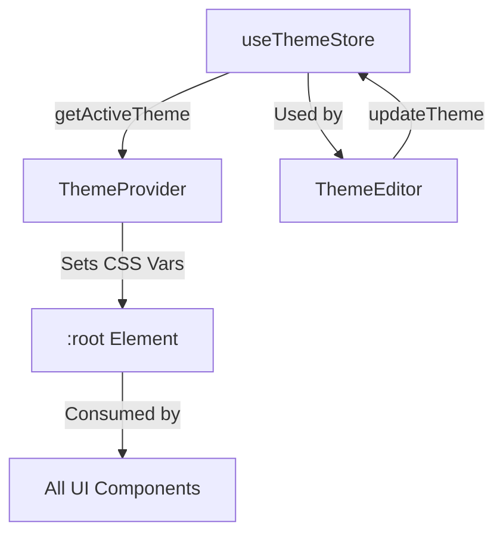

# 🎨 Theme Manager System (Zenith Design System)

> 📚 [← Back to Client Architecture](./client_architecture.md) | [← Documentation Hub](../../README.md)

DAWG uses the **Zenith Design System** for theming. It provides dynamic color palettes, design tokens, and workspace textures that can be switched at runtime.

---

## ⚡ Performance Notes

| Component | Cost | Notes |
|:---|:---|:---|
| `ThemeProvider` | Low | Runs once per theme change (not per frame). |
| `useThemeStore` | Minimal | Zustand store with persistence. |
| `useControlTheme` hook | Low | Reads from store, no re-renders unless theme changes. |

---

## 🏛️ Architecture Overview



### Key Files

| File | Role |
|:---|:---|
| `store/useThemeStore.js` | Zustand store holding all themes and the active theme ID. |
| `components/ThemeProvider.jsx` | Applies the active theme's tokens to `:root` CSS variables. |
| `features/theme_editor/ThemeEditor.jsx` | UI for users to create/edit themes. |
| `components/controls/useControlTheme.js` | Hook for controls (Knob, Fader) to access theme colors. |

---

## 🎨 Theme Structure

Each theme is an object with two main sections:

### 1. `colors` (Legacy/Core)
Basic color palette for backward compatibility.

```javascript
{
  backgroundDeep: '#0A0E1A',
  background: '#151922',
  surface: '#1E242F',
  primary: '#FFD700',
  accent: '#6B8EBF',
  text: '#FFFFFF',
  textMuted: '#A1A8B5',
  border: 'rgba(255, 255, 255, 0.1)'
}
```

### 2. `zenith` (Design Tokens)
Comprehensive design system tokens.

| Token Category | Examples |
|:---|:---|
| **Backgrounds** | `bg-primary`, `bg-secondary`, `bg-tertiary` |
| **Accents** | `accent-hot`, `accent-warm`, `accent-cool`, `accent-cold` |
| **Semantic** | `success`, `warning`, `error`, `info` |
| **Text** | `text-primary`, `text-secondary`, `text-tertiary` |
| **Borders** | `border-strong`, `border-medium`, `border-subtle` |
| **Shadows** | `shadow-sm`, `shadow-md`, `shadow-lg`, `shadow-xl` |
| **Typography** | `font-primary`, `font-mono` |
| **Spacing** | `radius-sm`, `radius-md`, `radius-lg`, `radius-xl` |
| **Animation** | `ease-out`, `ease-in-out`, `duration-fast`, `duration-normal` |
| **Workspace** | `workspace-texture-accent`, `workspace-grid-color`, `workspace-grid-size` |

---

## 📦 Built-in Themes (14)

| Theme Name | Primary Color | Style |
|:---|:---|:---|
| **Ghetto Star (Zenith)** | Gold | Default, professional |
| **8-Bit Night** | Green | Retro, square corners |
| **Analog Warmth** | Orange | Warm, vintage |
| **Cyberpunk Neon** | Magenta/Cyan | Futuristic |
| **Ocean Deep** | Blue | Calm, oceanic |
| **Forest Twilight** | Green | Natural, earthy |
| **Sunset Vibes** | Orange | Warm sunset |
| **Arctic Minimal** | Light Blue | Clean, icy |
| **Midnight Purple** | Purple | Dark, mysterious |
| **Retro Miami** | Pink/Cyan | 80s vibe |
| **Desert Heat** | Orange/Gold | Sandy, warm |
| **Matrix Code** | Green | Hacker aesthetic |
| **Lavender Dreams** | Purple | Soft, dreamy |
| **Anime Vibes** | Pink/Purple | Vibrant, anime-inspired |

---

## 🔧 Using the Theme System

### In Components (CSS Variables)
```css
.my-component {
  background: var(--zenith-bg-secondary);
  color: var(--zenith-text-primary);
  border: 1px solid var(--zenith-border-medium);
  border-radius: var(--zenith-radius-md);
}
```

### In React (useThemeStore)
```jsx
import { useThemeStore } from '@/store/useThemeStore';

function MyComponent() {
  const theme = useThemeStore(state => state.getActiveTheme());
  
  return (
    <div style={{ background: theme.zenith['bg-primary'] }}>
      Current Theme: {theme.name}
    </div>
  );
}
```

### In Controls (useControlTheme)
```jsx
import { useControlTheme } from '@/components/controls/useControlTheme';

function MyKnob() {
  const { colors, styles } = useControlTheme('accent');
  // colors.ring, colors.track, etc. are pre-calculated
}
```

---

## 🔄 Theme Persistence

The theme store uses `zustand/middleware/persist` to save the active theme to `localStorage` under the key `dawg-zenith-theme-manager`. This means the user's theme preference is remembered across sessions.

---

## ➕ Adding a New Theme

1. Open `useThemeStore.js`.
2. Add a new `createTheme()` call to the `defaultThemes` array.
3. Provide `colors` and `zenith` overrides.

```javascript
createTheme('My Theme',
  {
    primary: '#00FF00',
    accent: '#FF0000',
    backgroundDeep: '#000000',
    // ...
  },
  {
    'bg-primary': '#000000',
    'accent-hot': '#FF0000',
    // ...
  }
)
```

---

**Last Updated:** 2025-12-25
