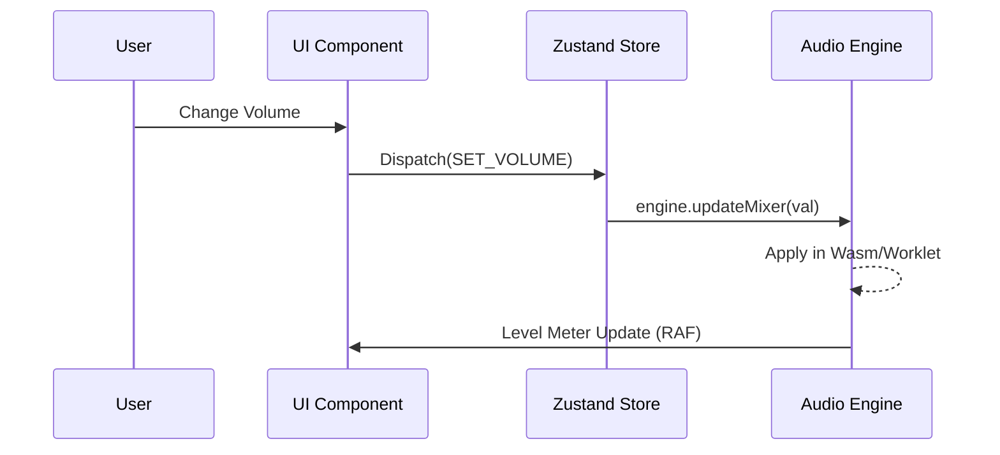

# Client Architecture Report

> 📚 [← Back to System Index](./index.md) | [← Documentation Hub](../README.md)

This report documents the architectural patterns and state management strategies used in the DAWG frontend.

---

## ⚡ Performance Critical Components

| Component | Function | Performance Note |
|:---|:---|:---|
| `PianoRoll.jsx` | `renderNotes()` | Canvas redraw on zoom/scroll. Use virtualization. |
| `UnifiedGridCanvas.jsx` | `drawGrid()` | Step grid rendering. Grows with pattern length. |
| `Zustand Stores` | All state updates | Minimize re-renders with selectors. |

---

## 🎨 UI Framework & Tooling

- **Core**: React 18+ for component-based UI.
- **Build System**: Vite for fast development and optimized production bundles.
- **Styling**: CSS Modules + Tailwind CSS.

---

## 📂 Feature-Driven Structure

The project follows a **Feature-Sliced Design** approach in `/client/src/features`. Each feature is self-contained:

| Feature | Location | Responsibilities |
|:---|:---|:---|
| `channel_rack` | `features/channel_rack/` | Grid-based sequencing, instrument management. |
| `piano_roll_v7` | `features/piano_roll_v7/` | MIDI editing, note manipulation tools. |
| `mixer` | `features/mixer/` | Signal routing, gain control, effect stacks. |
| `ai_instrument` | `features/ai_instrument/` | AI-powered instrument generation. |

---

## 🧠 State Management

DAWG uses a dual-state approach to balance UI responsiveness with audio engine synchronization.

### 1. UI State (Zustand)
Used for non-real-time state like project metadata, UI settings, and undo/redo stacks.
- **`useArrangementStore`**: Manages patterns, tracks, and notes.
- **`useMixerStore`**: Manages track gain, pan, and effect settings.
- **`useInstrumentsStore`**: Manages instrument instances.

### 2. Audio State (Singletons/EventBus)
The real-time state of the audio engine (playback position, current level meters) is managed outside React to avoid unnecessary re-renders.
- **`PlaybackController`**: The "Source of Truth" for playback status.
- **`UIUpdateManager`**: Coordinates `requestAnimationFrame` (RAF) loops to sync UI elements (like playheads) at 60fps.

---

## 🔄 Data Synchronization Flow

---

**Last Updated:** 2025-12-25
