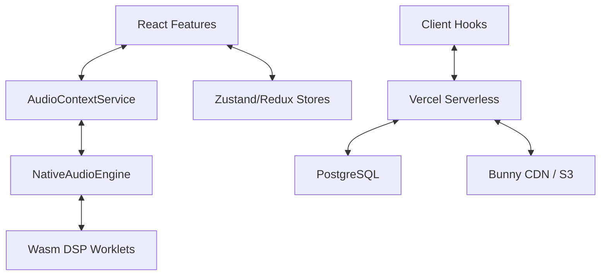

# DAWG File Index & Relationship Map

This document provides a categorized index of significant files in the DAWG repository and explains their roles and connections.

## 📂 Root Directory

| File | Role | Connections |
| :--- | :--- | :--- |
| `BUNNY_CDN_SETUP.md` | Deployment guide for asset delivery. | DevOps / Infrastructure |
| `ARCHITECTURE.md` | Legacy architecture overview. | Baseline for this index. |
| `package.json` | Project metadata and monorepo scripts. | NPM / Build system |

## 📦 Client-Side (`/dawg/client`)

### Core Audio Layer (`/src/lib`)

| File | Role | Connections |
| :--- | :--- | :--- |
| `core/NativeAudioEngine.js` | Main audio engine orchestration. | `AudioContext`, `PlaybackManager` |
| `services/AudioContextService.js` | Singleton hub for UI interaction. | React components, `NativeAudioEngine` |
| `core/PlaybackController.js` | Unified playback state management. | Redux stores, `TransportManager` |
| `wasm/dawg-audio-dsp/` | Rust source for high-performance DSP. | Wasm/Worklets |

### Feature Modules (`/src/features`)

| Component | Role | File Link |
| :--- | :--- | :--- |
| **Channel Rack** | Step sequencing & instrument slots. | [ChannelRack.jsx](../../client/src/features/channel_rack/ChannelRack.jsx) |
| **Piano Roll** | MIDI note editing. | [PianoRoll.jsx](../../client/src/features/piano_roll/PianoRoll.jsx) |
| **Mixer** | Gain, panning, and effect chains. | [Mixer.jsx](../../client/src/features/mixer/Mixer.jsx) |

## ⚙️ Server-Side (`/dawg/server`)

### Backend Core (`/src`)

| File | Role | Connections |
| :--- | :--- | :--- |
| `index.ts` | Fastify server entry point. | `routes/`, `plugins/`, `services/` |
| `routes/projects.ts` | Project CRUD and metadata API. | Database (Postgres) |
| `services/storage.ts` | Cloud storage (S3/Bunny) integration. | Audio blob storage |
| `websocket.ts` | Real-time collaboration engine. | Client-side WS hooks |

## ⚡ API Layer (`/dawg/api`)

| File | Role | Connections |
| :--- | :--- | :--- |
| `index.ts` | Vercel Serverless Function entry. | Proxies to Fastify logic. |

## 🗺️ Visual Relationship Map

## 📚 Deep Dive Specifications

Detailed engineering manuals are available for specific subsystems:

- **Audio Engine**: [DSP Protocol & Threading](./audio_engine/02_dsp_protocol.md)
- **Frontend**: [UI Component System](./client/02_ui_component_system.md)
- **Backend**: [Database & API Schema](./server/02_database_schema.md)
