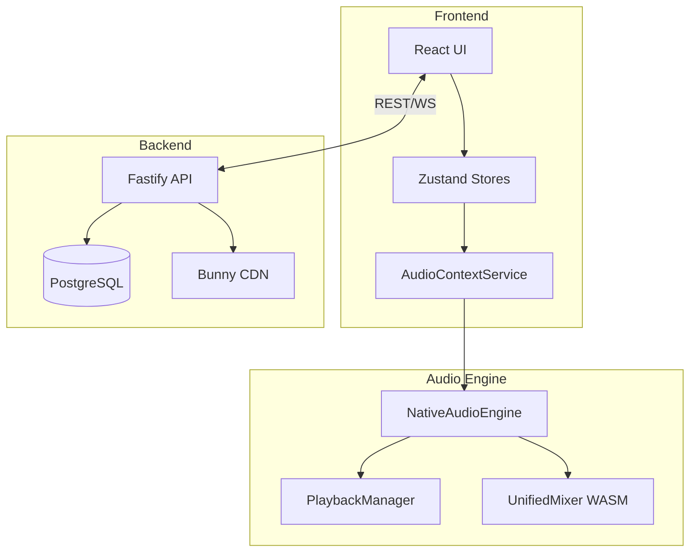

# DAWG System Index

> 📚 [← Back to Documentation Hub](../README.md)

This directory contains **Level 3 Deep Dive** specifications. These documents provide exact protocols, schemas, and code-level details.

## 📂 Contents

### Audio Engine
| Document | Description |
|:---|:---|
| [Audio Engine Report](./audio_engine_report.md) | High-level audio architecture overview. |
| [DSP Protocol](./audio_engine/02_dsp_protocol.md) | ⚡ **Critical Path** - JSON schema for Worklet communication. |

### Client (Frontend)
| Document | Description |
|:---|:---|
| [Client Architecture](./client_architecture.md) | React frontend and state management overview. |
| [UI Component System](./client/02_ui_component_system.md) | Props API for Knob, Fader, EnvelopeEditor. |

### Server (Backend)
| Document | Description |
|:---|:---|
| [Server Architecture](./server_architecture.md) | Fastify backend and deployment overview. |
| [Database & API Schema](./server/02_database_schema.md) | PostgreSQL tables and Fastify route definitions. |

## ⚡ Hot Paths

The following code paths are **performance-critical** and should be understood before modification:

1.  **`process_mix()` in `lib.rs`**: The Wasm DSP core. Runs on every audio frame.
2.  **`renderNotes()` in `renderer.js`**: Piano Roll canvas drawing. Called on every scroll/zoom.
3.  **`_schedulePatternContent()` in `PlaybackManager.js`**: Schedules all notes on play/seek.

---

## 🗺️ Visual Overview

---

**Last Updated:** 2025-12-25
